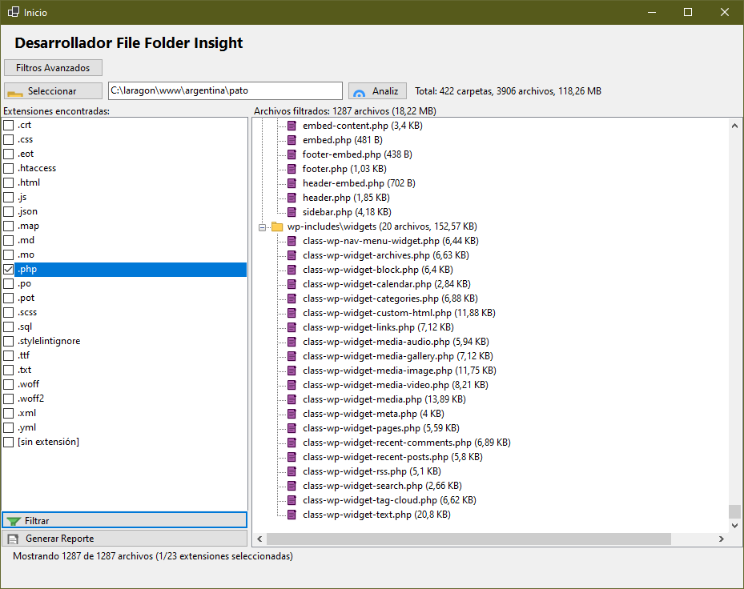

# Desarrollador-FFolderInsight
Herramienta de análisis de directorios para desarrolladores que permite inspeccionar la estructura de carpetas, filtrar por extensiones y generar reportes detallados del contenido.

# Folder Insight

 

Herramienta de análisis de directorios para desarrolladores que permite inspeccionar la estructura de carpetas, filtrar por extensiones y generar reportes detallados del contenido.

## Características Principales

- 🔍 Análisis recursivo de directorios y subdirectorios
- 📊 Estadísticas de archivos y carpetas
- ✅ Filtrado por extensiones con interfaz visual
- 🌳 Vista de árbol de la estructura de archivos
- 📝 Generación de reportes con contenido de archivos
- 🖨️ Opciones para imprimir o guardar reportes

## Requisitos

- .NET 8.0
- Windows 10/11 (por ser aplicación Windows Forms)

## Instalación

1. Descarga el [último release](https://github.com/marcoantoniop/Desarrollador-FFolderInsight)

## Uso Básico

1. Haz clic en "Seleccionar Carpeta"
2. Espera a que complete el análisis
3. Selecciona las extensiones que deseas incluir
4. Haz clic en "Filtrar"
5. Genera reportes con el botón correspondiente

## Roadmap

- [ ] Exportación a HTML/PDF
- [ ] Búsqueda dentro de archivos
- [ ] Vista previa de archivos
- [ ] Gráficos estadísticos

## Contribución

Las contribuciones son bienvenidas. Por favor abre un Issue antes de enviar un Pull Request.

## Licencia

MIT © Marco A. Paredes
